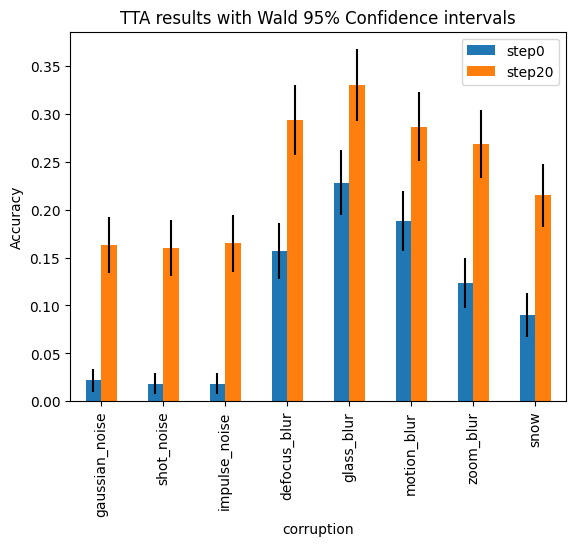
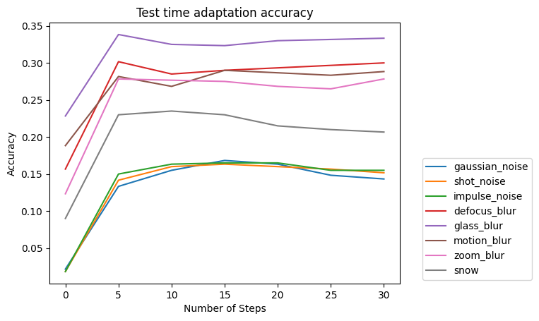

# Reconstruction of results from the paper: Gandelsman et al. 'Test-Time Training with Masked Autoencoders' 2022

## Appraoch:
Used the pretrained model "facebook/vit-mae-base" as an encoder, and layers from ViT followed by a linear read out as a decoder.
During test-time training (which I will call test-time adaptation = TTA), the encoder is finetuned for image reconstruction (the pretraining objective) on each image individually before classification is performed.

## Results:
1. We reproduce the accuracy improvement under test-time adaptation.

2. We do see some 'peaks' in accuracy when using the Adam optimizer, similar to Fig 2a. However, the number of optimization steps that we plot here is larger, and the peaks are less dramatic.

## Technical points:
1. Test time adaptation is very resource intensive. I have only plotted 8 different corruption conditions, each sampled using only 600 datapoints. This dataset alone required 10 hours on a 4090 to compute (timed independently as ~5s per image).

## Future:
1. Speed-up: lora, 16 bit precision
2. TTA on multiple images at once: adaptation to the dataset overall replacing image-wise adaptation. This would certainly improve speed, but decrease the effective sample size.
3. Perform fewer steps of TTA: here and in the paper, we saw most of the improvement occuring in the first couple of steps (with the Adam optimizer) 